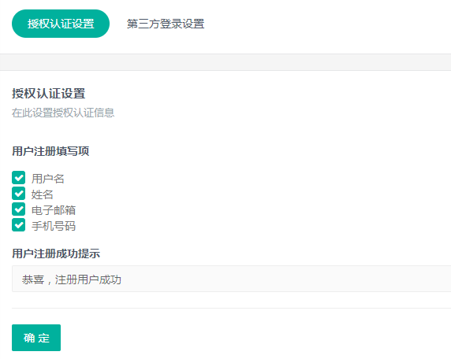
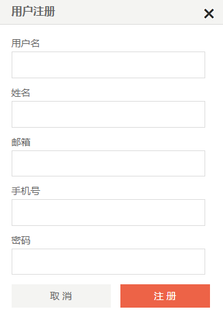
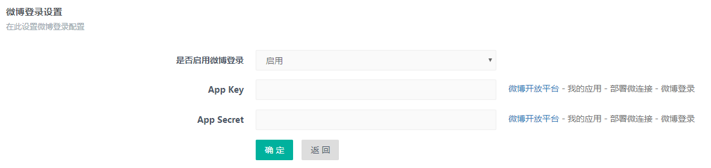

# SS.Login 用户登录插件

用于登录用户中心

### 1、 用户登录设置

* 安装成功后，插件管理中可以看到用户登录设置


* 点击授权认证设置来设置用户注册需要添加的字段，设置用户注册成功提示语



### 2、 用户登录注册退出标签调用

* 登录标签：

```
<stl:login>登录</stl:login>
```


* 注册标签：

```
<stl:register>注册</stl:register>
```



* 退出标签：

```
<stl:logout>退出</stl:logout>
```

### 3、第三方登录`<stl:login>`标签说明

* 目前第三方登录有微博登录、微信登录、QQ登录

| 属性 | 可能的取值 | 简介 |
| --- | :---: | :--- |
| type |  | 第三方登录类型 |
|  | weibo | 使用微博登录 |
|  | weixin | 使用微信登录 |
|  | qq | 使用QQ登录 |
|  | all | 一键登录 |

### 4、第三方登录参数配置

* 第三方登录首先要配置 App Key 和 APP Secret




### 5、第三方登录标签调用

```
<stl:login type="weibo">微博登录</stl:login>
<stl:login type="weixin">微信登录</stl:login>
<stl:login type="qq">QQ登录</stl:login>
<stl:login type="all">一键登录</stl:login>
```
