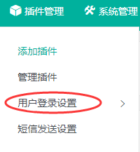
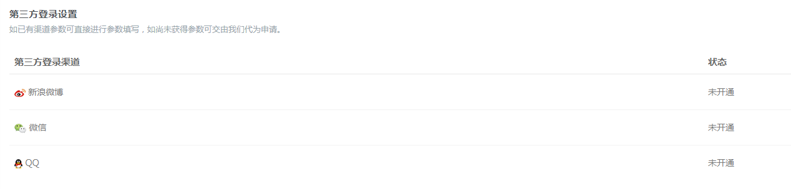

# SiteServer CMS 登录插件


本文档旨在全面介绍 SS.Login - SiteServer CMS 登录插件。

登录插件（SS.Login）专注于用户登录相关功能，用于实现登录、注册、退出等功能，同时集成微信、微博、QQ一键登录。

其他插件开发时可以引用此插件以实现用户相关的操作。

## 源代码

您可以在 [SS.Login 源码仓库](https://github.com/siteserver/ss.login) 中查看并获取登录插件最新源代码。

## 插件主页

可以访问 [SS.Login 插件主页](https://www.siteserver.cn/plugins/plugin.html?id=SS.Login) 获取插件详细信息。

## 1、 用户登录设置

* 安装成功后，插件管理中可以看到用户登录设置



* 点击授权认证设置来设置用户注册需要添加的字段，设置用户注册成功提示语


## 2、 用户登录注册退出标签调用

* 登录标签：

```
<stl:login>登录</stl:login>
```


* 注册标签：

```
<stl:register>注册</stl:register>
```


* 退出标签：

```
<stl:logout>退出</stl:logout>
```

## 3、第三方登录`<stl:login>`标签说明

* 目前第三方登录有微博登录、微信登录、QQ登录

| 属性 | 可能的取值 | 简介 |
| --- | :---: | :--- |
| type |  | 第三方登录类型 |
|  | weibo | 使用微博登录 |
|  | weixin | 使用微信登录 |
|  | qq | 使用QQ登录 |
|  | all | 一键登录 |

## 4、第三方登录参数配置

* 第三方登录首先要配置 App Key 和 APP Secret




## 5、第三方登录标签调用

```
<stl:login type="weibo">微博登录</stl:login>
<stl:login type="weixin">微信登录</stl:login>
<stl:login type="qq">QQ登录</stl:login>
<stl:login type="all">一键登录</stl:login>
```
