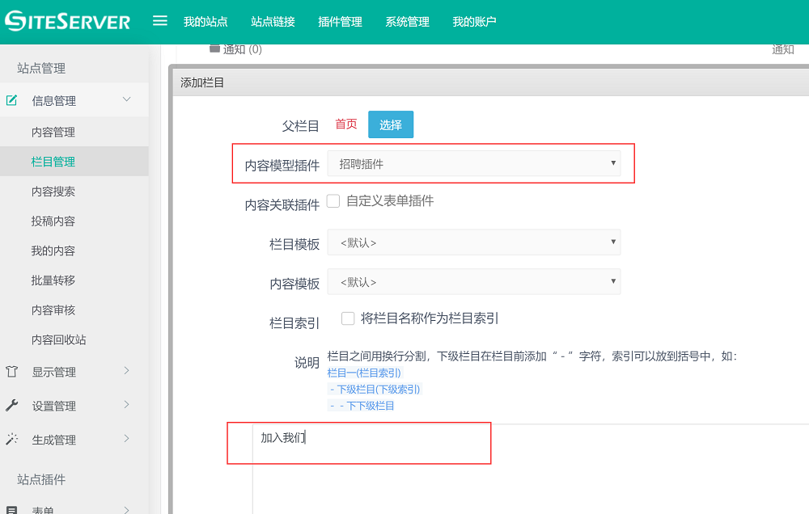
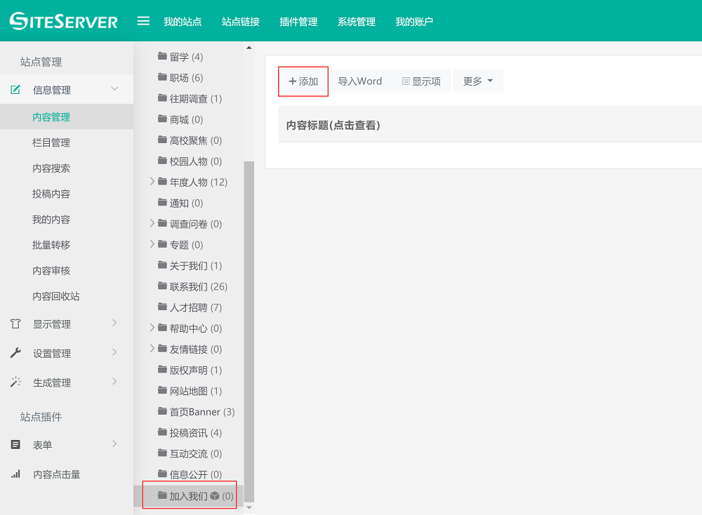

# 后台设置与发布

安装完毕招聘插件后，我们就可以在后台发布招聘信息了。

首先，我们需要先添加栏目用于保存招聘信息。

## 添加招聘栏目

进入 SiteServer CMS 后台 **栏目管理** 界面，在页面底部点击 **快速添加** 按钮，进入添加栏目界面：

在 **内容模型插件** 下拉框中选择 **招聘插件**，在下方的内容框中填写希望添加的栏目名称，点击确认按钮。

## 发布招聘信息

添加完毕招聘栏目后，进入后台 **内容管理** 界面，在栏目树中找到刚才添加的栏目，点击进入内容管理界面：

在内容管理界面中点击 **添加** 按钮，进入招聘信息发布界面：

在添加内容界面中，可以看到与招聘相关的字段，按照字段名称添加相应的内容，点击确定按钮，完成招聘信息的录入。