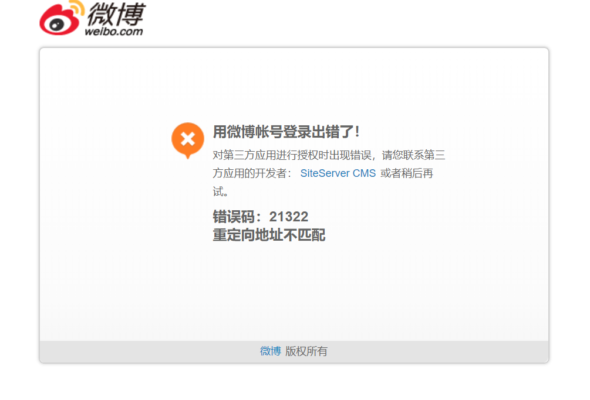
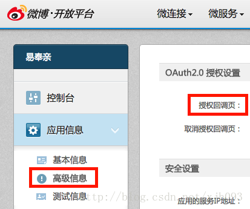
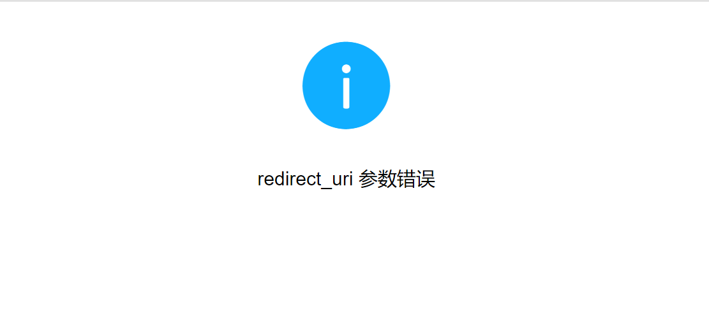
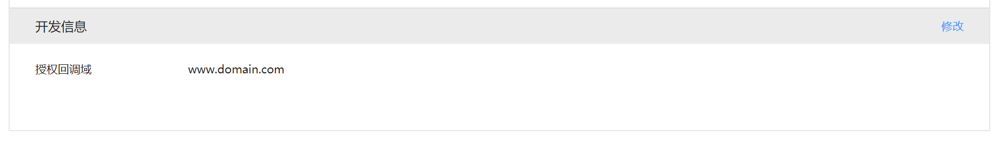
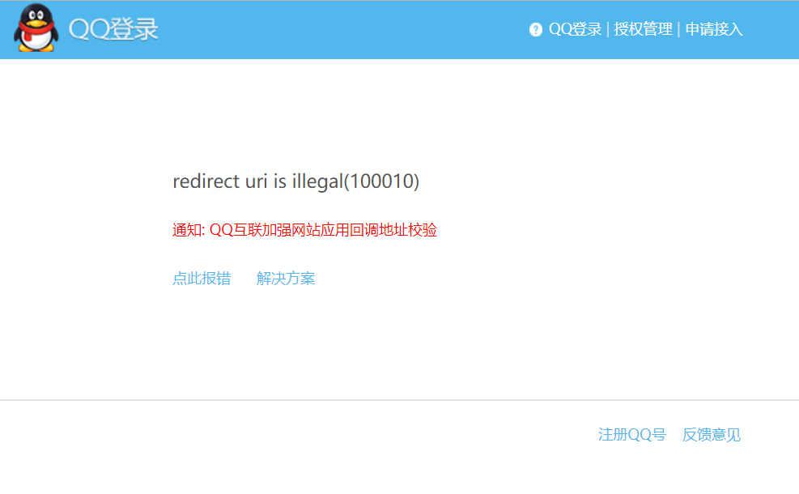

# 第三方登录常见错误

第三方登录集成经常由于配置不正确导致报错，我们摘录了一些常见的错误以及解决方案：

## 新浪微博登录（重定向地址不正确）

出现这个错误一般是因为没有设置回调地址或者回调地址不正确导致的。

登录[微博开放平台](http://open.weibo.com/) ,选择[管理中心]->[我的应用]->[“您的应用名”]->展开左侧[应用信息]->[高级信息]->OAuth2.0 授权设置 右上角[编辑]->在框里填入回调地址即可。

请将**授权回调页**设置为正式的域名地址（如果网站API为独立部署，请设置为API的访问域名）。

## 微信登录（参数错误）

出现这个错误一般是因为授权回调域不正确导致的。

登录[微信开放平台](https://open.weixin.qq.com/) 进入应用详情页，点击修改：

请将**授权回调域**设置为正式的域名地址（如果网站API为独立部署，请设置为API的访问域名）。

## QQ登录（redirect uri is illegal(100010)）

出现这个错误一般是因为网站回调域不正确导致的。

登录[QQ互联](https://open.qq.qq.com/) 进入应用详情页，点击修改：

请将**网站回调域**设置为正式的域名地址（如果网站API为独立部署，请设置为API的访问域名） + “/api/SS.Login/auth/Qq/redirect”，如：`http://www.domain.com/api/SS.Login/auth/Qq/redirect`