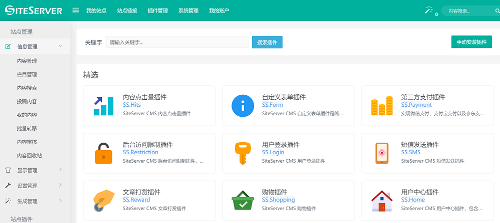
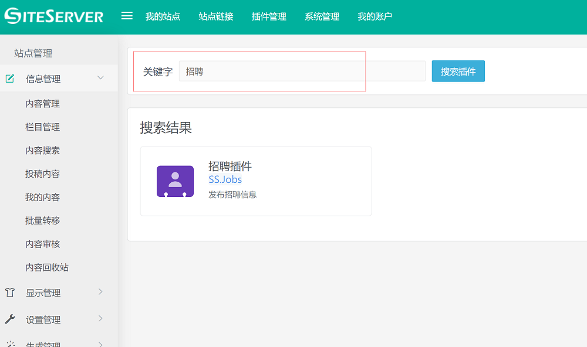
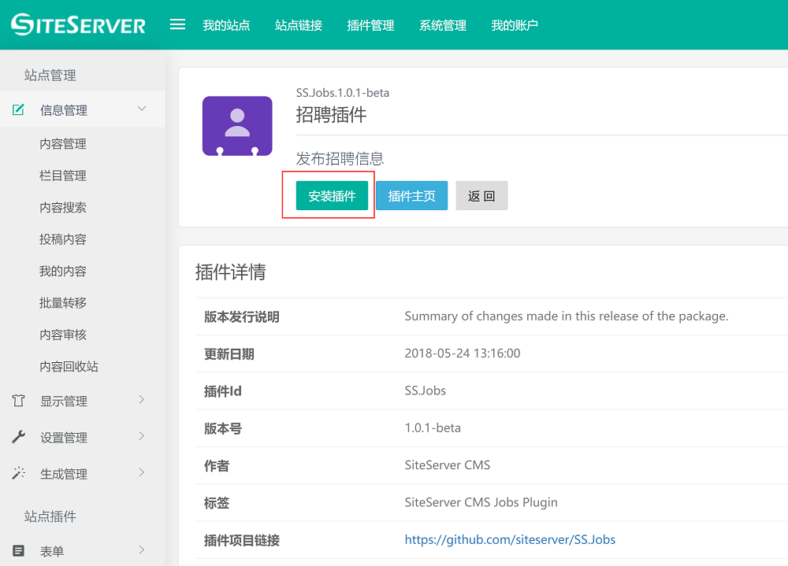
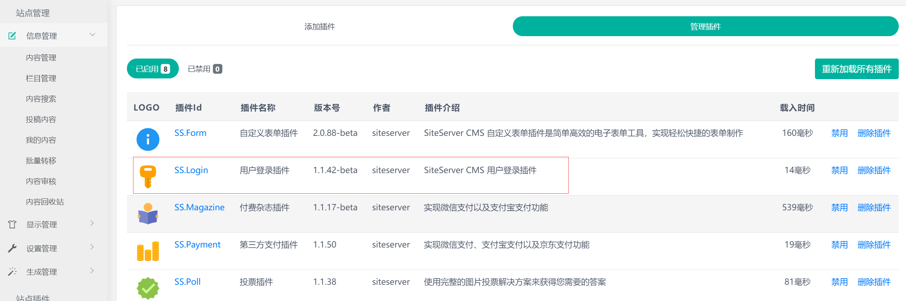

# 安装登录插件

安装登录插件需要进入 SiteServer CMS 管理后台。

## 1、进入添加插件界面

使用超级管理员身份进入 SiteServer CMS 后台，在主菜单中进入 `插件管理 -> 添加插件` 界面：

## 2、搜索登录插件

在头部的搜索栏中输入`登录`或者`login`，系统将搜索出登录插件：

## 3、安装登录插件

点击登录插件图标，进入登录插件详细界面：

点击 `安装插件` 按钮即可进入安装界面，系统将自动安装插件并重新载入页面。

## 4、查看已安装插件

安装完毕后，在主菜单中进入 `插件管理 -> 管理插件` 界面，你将能够看到刚刚安装好的登录插件

至此，插件已安装完毕。

接下来我们就可以使用登录插件了，如果需要使用第三方登录功能，需要进入后台插件管理的第三方登录设置中进行参数配置，如果不需要第三方登录，现在就可以直接将登录相关标签添加到模板中了。