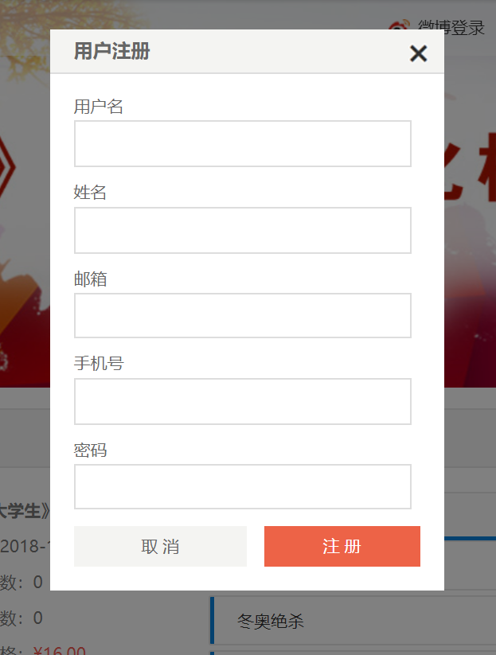

# &lt;stl:register&gt; 注册标签

注册标签用于在页面中弹出注册框。

```html
<stl:register redirectUrl="注册成功后的转向地址"></stl:register>
```

## 说明

&lt;stl:register&gt; 元素最终将解析为超链接a标签，所有a标签可用的属性均可以加到stl:register标签中。

可以把任何 STL 标签或者 HTML 标签（图片等）嵌套在 &lt;stl:register&gt; 元素内，用户点击嵌套的内容时页面将弹出注册框。

## 属性

所有属于HTML 标签&lt;a&gt;的属性均适用于&lt;stl:a&gt;标签，请参考：[HTML &lt;a&gt; 元素](http://docs.siteserver.cn/stl/#/reference_html/a)。

| 属性                                         | 说明                 |
| -------------------------------------------- | -------------------- |
| [redirectUrl](register?id=redirectUrl)   | 注册成功后的转向地址             |

### redirectUrl

设置注册成功后的转向地址，如果不设置，默认为返回当前页面。

```html
<!-- 注册成功后转入用户中心 -->
<stl:register redirectUrl="/home"></stl:register>
```

## &lt;stl:register&gt; 注册标签示例

```html
<!-- 注册标签 -->
<stl:register class="btn">注册</stl:register>
```

标签将解析为：
```html
<a href="javascript:;" class="btn" onclick="$authVue.openRegisterModal()">注册</a>
```

点击链接后将弹出注册框：

