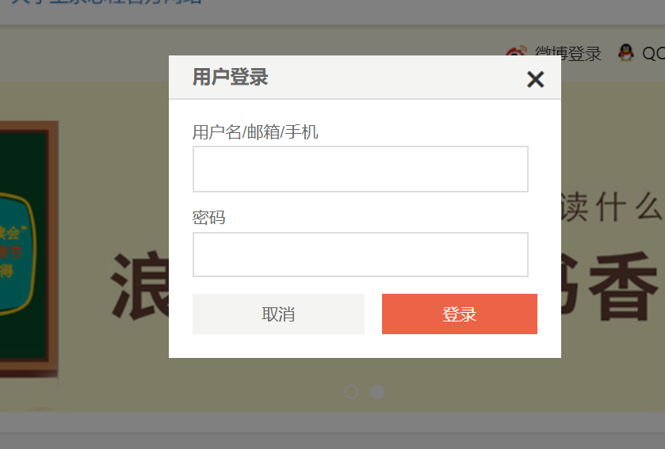
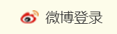
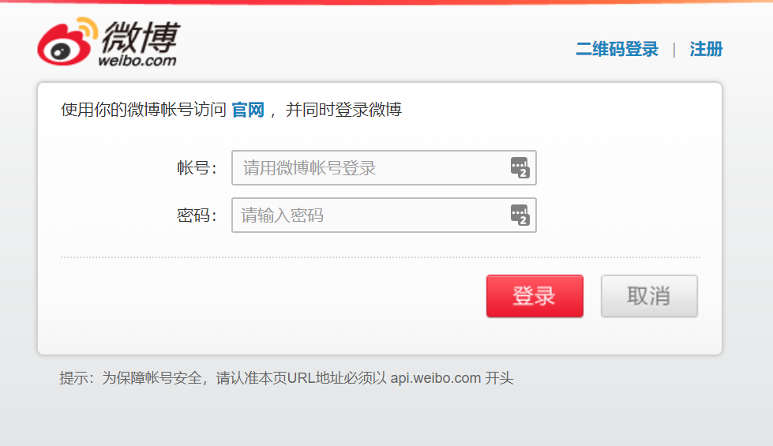
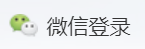
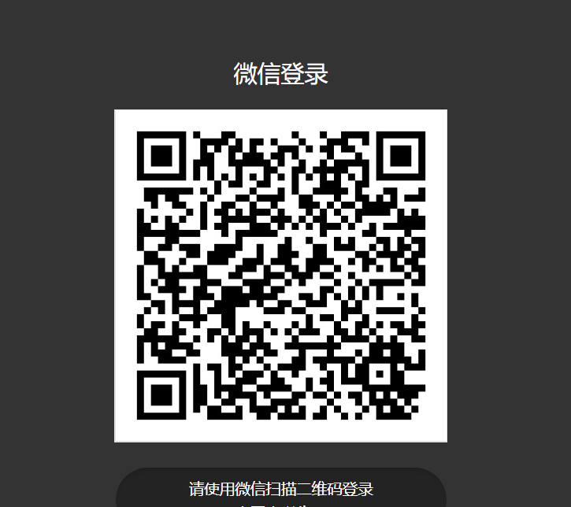
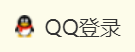
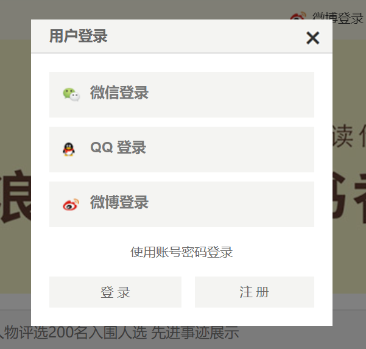

# &lt;stl:login&gt; 登录标签示例

### 默认登录

默认的登录标签不设置type属性或者type属性设置为`default`：

```html
<!-- 默认登录 -->
<stl:login class="btn">登录</stl:login>
```

标签将解析为：
```html
<a href="javascript:;" class="btn" onclick="$authVue.openLoginModal()">登录</a>
```

点击链接后将弹出登录框：



### 新浪微博登录

新浪微博登录首先需要配置第三方登录参数，请参考：

采用新浪微博登录需要将type属性设置为`weibo`：

```html
<!-- 新浪微博登录 -->
<stl:login type="weibo">
    
    微博登录
</stl:login>
```

标签将解析为：


点击链接后将转至新浪微博登录界面：



### 微信登录

微信登录首先需要配置第三方登录参数，请参考：

采用微信登录需要将type属性设置为`weixin`：

```html
<!-- 微信登录 -->
<stl:login type="weixin">
    
    微信登录
</stl:login>
```

标签将解析为：


点击链接后将转至微信登录界面：



### QQ登录

QQ登录首先需要配置第三方登录参数，请参考：

采用QQ登录需要将type属性设置为`qq`：

```html
<!-- QQ登录 -->
<stl:login type="qq">
    
    QQ登录
</stl:login>
```

标签将解析为：


点击链接后将转至QQ登录界面：


### 包含所有方式的登录框

除了以上针对各种登录方式的标签写法，我们也可以直接使用`type="all"`，使得所有可能的登录方式集合在同一个登录框中：

```html
<!-- 一键登录 -->
<stl:login type="all">登录</stl:login>
```

点击链接后将弹出登录框：



在此我们能够一键登录或者输入用户名密码登录。