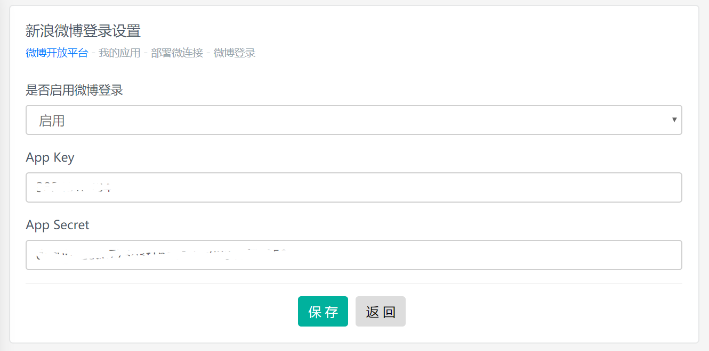
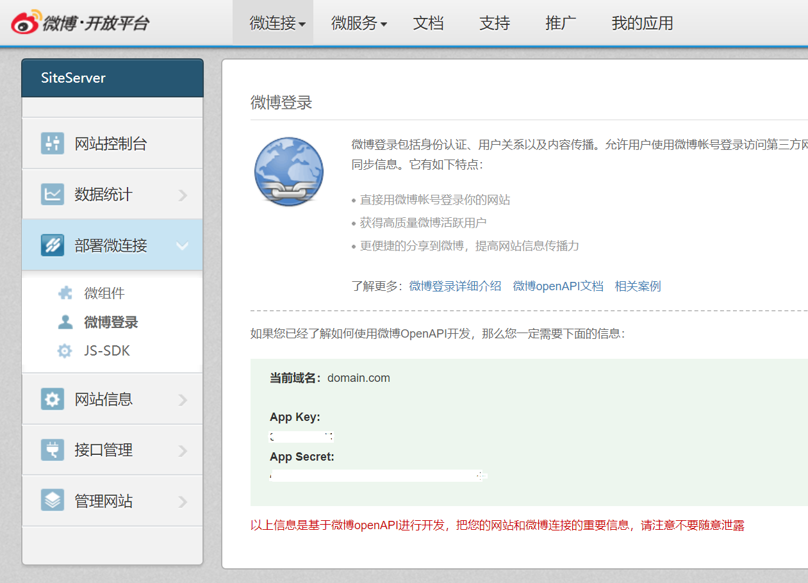
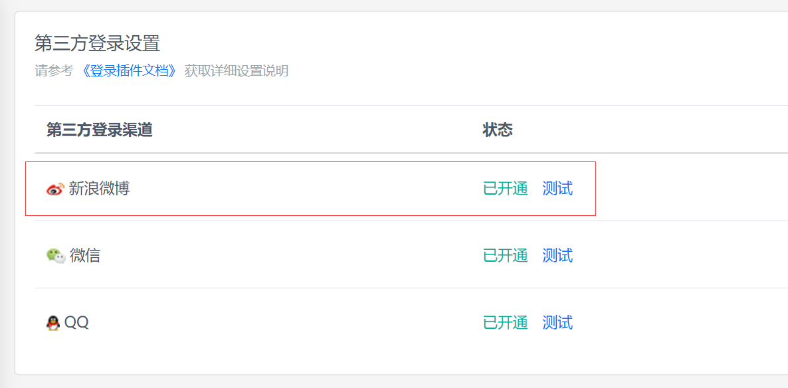

# 新浪微博登录设置

## 进入设置界面

集成新浪微博一键登录需要首选进入 SiteServer CMS 管理后台第三方登录设置：

点击新浪微博，进入详细设置界面：

现在我们需要获取 App Key以及 App Secret值。

## 获取参数值

App Key以及 App Secret值需要从 [微博开放平台](http://open.weibo.com/) 获取，进入微博开放平台，找到**我的应用**，点击**部署微连接**，**微博登录**：

详细步骤请参考：[http://open.weibo.com/authentication](http://open.weibo.com/authentication)。

## 测试

设置完成后进入 SiteServer CMS 后台第三方登录页面，点击**测试**链接，如果链接地址为微博登录界面，说明设置成功。

注意：必须在正式域名下进行测试，否则可能无法成功。 