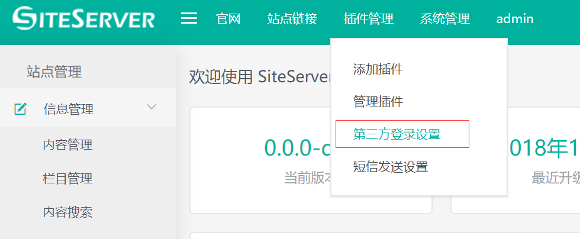
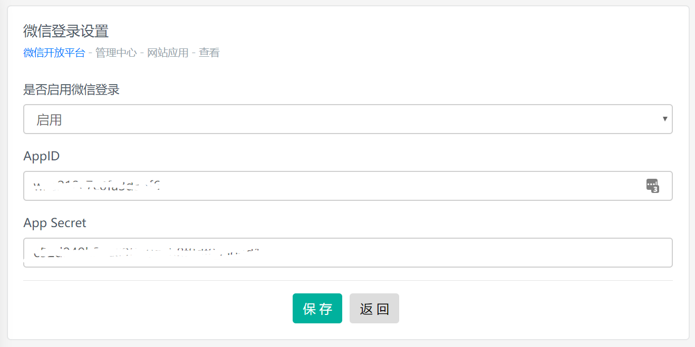
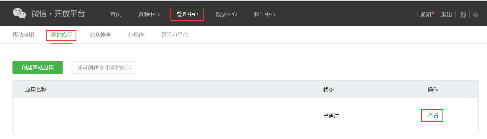
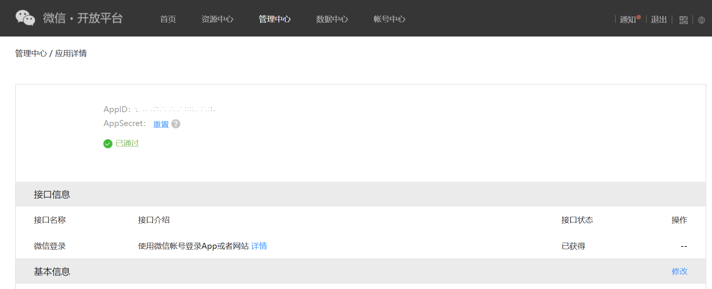
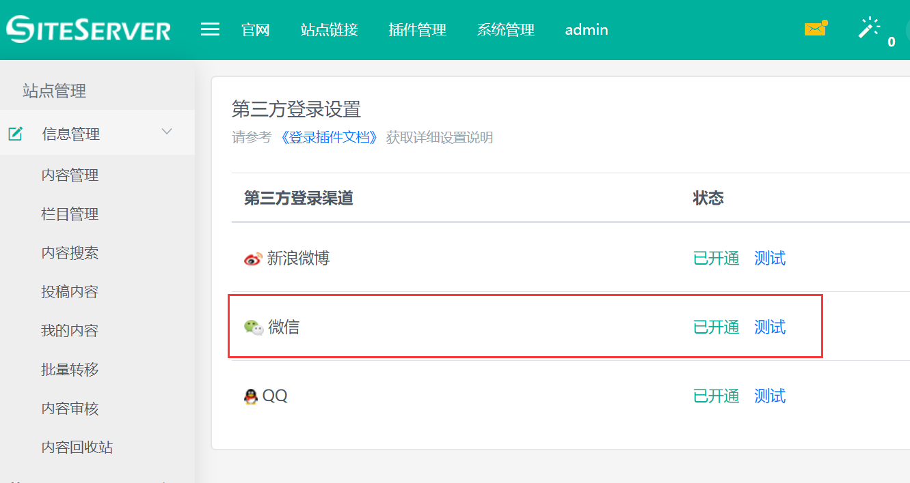

# 微信登录设置

## 进入设置界面

集成微信一键登录需要首选进入 SiteServer CMS 管理后台第三方登录设置：

点击微信，进入详细设置界面：

现在我们需要获取 AppID以及 App Secret值。

## 获取参数值

AppID以及 App Secret值需要从 [微信开放平台](https://open.weixin.qq.com/) 获取，进入微信开放平台，找到**管理中心**，点击**网站应用**：

点击右侧**查看**链接：

## 授权回调域

请确保应用详情页面中最底部的**授权回调域**为正式的域名地址（如果网站API为独立部署，请设置为API的访问域名），否则微信登录页面将报错。

如果授权回调域不正确，可以点击修改链接，进行修改。

## 测试

设置完成后进入 SiteServer CMS 后台第三方登录页面，点击**测试**链接，如果链接地址为微信登录界面，说明设置成功。

注意：必须在正式域名下进行测试，否则可能无法成功。 